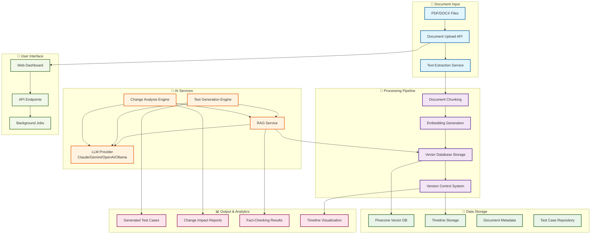

# TraceQA - Enterprise Requirements AI

A comprehensive system for managing enterprise requirements, generating test cases, and tracking changes in banking and financial services projects. Built with privacy and compliance in mind, this system operates entirely on-premises and can work with local LLMs, Anthropic Claude, Google Gemini, or OpenAI.

## 🚀 Quick Start

```bash
# Clone the repository
git clone https://github.com/ArshanBhanage/TraceQ.git
cd TraceQA

# Start with Docker Compose
docker-compose up -d

# Or run locally
cd backend
pip install -r requirements.txt
uvicorn app.main:app --host 0.0.0.0 --port 8000
```

## 🎯 Problem Statement

Enterprise banking projects face several challenges:
- **Multiple teams and companies** working on different environments (Dev, SIT, UAT)
- **500+ test cases** need to be generated from confidential client requirements (FSDs)
- **Frequent requirement changes** via addendums, annexures, and email communications
- **Time-consuming bug triage** due to difficulty tracking requirement changes
- **Compliance requirements** for government banks that don't trust cloud/AI solutions

## 🏗️ Architecture

### Core Components

1. **Document Processing Service** - Extracts text from PDF, DOCX, and plain text files
2. **RAG (Retrieval-Augmented Generation) Service** - Chunks, embeds, and searches requirements
3. **Requirements Versioning** - Tracks timeline of changes with semantic diffing
4. **Test Generation** - Creates test cases using retrieved context and LLM
5. **Background Processing** - Handles large operations asynchronously
6. **Provider Abstraction** - Switchable between local (Ollama), Anthropic Claude, Google Gemini, and OpenAI

### Data Flow



### System Architecture Overview

The system follows a modern microservices architecture with clear separation of concerns:

1. **📄 Document Ingestion**: Multi-format document processing with automatic text extraction
2. **🔄 Processing Pipeline**: Intelligent chunking, embedding generation, and vector storage
3. **🤖 AI Services**: Flexible LLM integration with RAG-powered context retrieval
4. **💾 Data Storage**: Scalable vector database with version control and metadata tracking
5. **📊 Output & Analytics**: Comprehensive reporting and visualization capabilities
6. **👥 User Interface**: RESTful APIs with real-time dashboard and background processing

## 🚀 Features

### 1. Document Ingestion
- **Supported Formats**: PDF, DOCX, Plain Text
- **Automatic Text Extraction**: Uses python-magic for format detection
- **Journey-based Organization**: Group requirements by business process (e.g., "Point of Settlement")
- **Metadata Tracking**: Source type, effective date, notes, auto-generated summaries

### 2. Intelligent Search & Retrieval
- **Semantic Search**: Find relevant requirements using natural language queries
- **RAG-powered**: Combines vector similarity with LLM reasoning
- **Context-aware**: Retrieves chunks with relevance scoring and categorization

### 3. Change Management
- **Version Timeline**: Complete history of requirement changes
- **Semantic Diffing**: LLM-powered analysis of functional vs. cosmetic changes
- **Impact Assessment**: Automatic evaluation of how changes affect existing tests
- **Recommendations**: Actionable guidance for test updates

### 4. Test Case Generation
- **Context-aware**: Uses retrieved requirements to generate relevant tests
- **Batch Processing**: Handle 500+ test cases with background jobs
- **Multiple Scenarios**: Positive, negative, boundary, and compliance cases
- **Traceability**: Link tests back to source requirements

### 5. Fact-checking & Triage Support
- **Evidence Retrieval**: Find supporting documentation for claims
- **Confidence Scoring**: Assess strength of evidence
- **Source Attribution**: Track document origins and timestamps
- **Triage Acceleration**: Reduce time spent on bug investigation

## 🔧 Installation & Setup

### Prerequisites
- Python 3.8+
- Ollama (for local LLM support)
- FastAPI + Uvicorn

### Quick Start

1. **Clone and Install Dependencies**
```bash
git clone <repository>
cd enterprise-requirements-ai/backend
python3 -m venv venv
source venv/bin/activate
pip install -r requirements.txt
```

2. **Environment Configuration**
```bash
# LLM Provider (claude, gemini, ollama, or openai)
export LLM_PROVIDER=claude

# For Claude (default)
export ANTHROPIC_API_KEY=your_anthropic_api_key_here

# For Gemini (optional)
export GEMINI_API_KEY=your_gemini_api_key_here

# For OpenAI (optional)
export OPENAI_API_KEY=your_openai_api_key_here
export EMBED_MODEL=text-embedding-3-small

# For Ollama (local)
export LLM_PROVIDER=ollama
export EMBED_MODEL=nomic-embed-text

# Storage paths (customizable)
export OBJECT_STORE=/path/to/document/storage
export RAG_INDEX_DIR=/path/to/rag/index
export REQ_VERSIONS_DIR=/path/to/versions
```

3. **Start Ollama (if using local LLMs)**
```bash
ollama serve
ollama pull llama3.1:8b-instruct
ollama pull nomic-embed-text
```

4. **Run the Application**
```bash
cd backend
source venv/bin/activate
uvicorn app.main:app --reload --host 0.0.0.0 --port 8000
```

## 📚 API Reference

### Requirements Management

#### Get Provider Information
```http
GET /api/requirements/provider-info
```

#### Test Claude Integration
```http
POST /api/requirements/test-claude
```

#### Ingest Document
```http
POST /api/requirements/ingest
{
  "journey": "Point of Settlement",
  "document_uri": "/path/to/fsd.pdf",
  "source_type": "fsd",
  "effective_date": "2024-01-15",
  "notes": "Initial FSD for POS journey"
}
```

#### Search Requirements
```http
POST /api/requirements/search
{
  "journey": "Point of Settlement",
  "query": "settlement failure scenarios",
  "top_k": 10
}
```

#### Analyze Changes
```http
POST /api/requirements/analyze-changes
{
  "journey": "Point of Settlement",
  "from_version": "20240115T100000Z-fsd",
  "to_version": "20240120T140000Z-addendum"
}
```

#### Get Timeline
```http
GET /api/requirements/timeline/Point of Settlement
```

#### Fact Check
```http
POST /api/requirements/fact-check
{
  "journey": "Point of Settlement",
  "claim": "Settlement must complete within 2 hours",
  "top_k": 10
}
```

### Test Generation

#### Generate Tests
```http
POST /api/tests/generate
{
  "journey": "Point of Settlement",
  "max_cases": 100,
  "context_top_k": 20,
  "provider": "gemini"
}
```

#### Batch Generation (Background)
```http
POST /api/background/batch-test-generation?journey=Point of Settlement&max_cases=500
```

### Background Tasks

#### Monitor Task Status
```http
GET /api/background/tasks/{task_id}
```

#### List Active Tasks
```http
GET /api/background/tasks
```

#### Cancel Task
```http
DELETE /api/background/tasks/{task_id}
```

## 🔒 Security & Compliance

### On-Premises Deployment
- **No Cloud Dependencies**: All processing happens locally (unless using Claude/Gemini/OpenAI)
- **File-based Storage**: Documents stored on local filesystem
- **Air-gapped Capable**: Can operate without internet access when using Ollama
- **Audit Trail**: Complete logging of all operations

### Data Privacy
- **Local Embeddings**: Vector embeddings generated and stored locally
- **Provider Selection**: Choose between local (Ollama), Claude, Gemini, or OpenAI
- **Document Isolation**: Each journey's data is separately indexed
- **Access Control**: File system permissions control document access

### Compliance Features
- **Version Control**: Complete audit trail of requirement changes
- **Source Attribution**: Track origin of every requirement
- **Change Impact**: Assess effect of modifications on existing tests
- **Evidence Chain**: Link tests back to source requirements

## 🚀 Usage Examples

### 1. Initial Setup for a New Journey

```bash
# 1. Upload FSD document
curl -X POST "http://localhost:8000/api/upload" \
  -F "file=@fsd_point_of_settlement.pdf"

# 2. Ingest the requirement
curl -X POST "http://localhost:8000/api/requirements/ingest" \
  -H "Content-Type: application/json" \
  -d '{
    "journey": "Point of Settlement",
    "document_uri": "/path/to/uploaded/fsd.pdf",
    "source_type": "fsd",
    "effective_date": "2024-01-15"
  }'

# 3. Generate initial test cases
curl -X POST "http://localhost:8000/api/tests/generate" \
  -H "Content-Type: application/json" \
  -d '{
    "journey": "Point of Settlement",
    "max_cases": 100
  }'
```

### 2. Testing Claude Integration

```bash
# Check which provider is active
curl -X GET "http://localhost:8000/api/requirements/provider-info"

# Test Claude with a simple prompt
curl -X POST "http://localhost:8000/api/requirements/test-claude"
```

### 3. Handling Requirement Changes

```bash
# 1. Ingest addendum
curl -X POST "http://localhost:8000/api/requirements/ingest" \
  -H "Content-Type: application/json" \
  -d '{
    "journey": "Point of Settlement",
    "document_uri": "/path/to/addendum.pdf",
    "source_type": "addendum",
    "effective_date": "2024-01-20"
  }'

# 2. Analyze impact of changes
curl -X POST "http://localhost:8000/api/requirements/analyze-changes" \
  -H "Content-Type: application/json" \
  -d '{
    "journey": "Point of Settlement",
    "from_version": "20240115T100000Z-fsd",
    "to_version": "20240120T140000Z-addendum"
  }'

# 3. Regenerate affected tests
curl -X POST "http://localhost:8000/api/tests/generate" \
  -H "Content-Type: application/json" \
  -d '{
    "journey": "Point of Settlement",
    "max_cases": 50,
    "context_top_k": 30
  }'
```

### 4. Bug Triage Support

```bash
# 1. Fact-check a claim during triage
curl -X POST "http://localhost:8000/api/requirements/fact-check" \
  -H "Content-Type: application/json" \
  -d '{
    "journey": "Point of Settlement",
    "claim": "Settlement timeout is configurable",
    "top_k": 15
  }'

# 2. Get timeline to understand context
curl -X GET "http://localhost:8000/api/requirements/timeline/Point of Settlement"
```

## 🔧 Configuration Options

### LLM Provider Selection

```bash
# Use Anthropic Claude (default)
export LLM_PROVIDER=claude
export ANTHROPIC_API_KEY=your_api_key_here

# Use local Ollama models
export LLM_PROVIDER=ollama
export EMBED_MODEL=nomic-embed-text

# Use OpenAI (requires internet)
export LLM_PROVIDER=openai
export OPENAI_API_KEY=your_key
export EMBED_MODEL=text-embedding-3-small
```

### Storage Paths

```bash
# Customize storage locations
export OBJECT_STORE=/enterprise/docs
export RAG_INDEX_DIR=/enterprise/rag
export REQ_VERSIONS_DIR=/enterprise/versions
```

### Performance Tuning

```bash
# Background processing workers
export MAX_WORKERS=8

# RAG chunk sizes
export MAX_CHUNK_TOKENS=800
export CHUNK_OVERLAP=120
```

## 🧪 Testing

### Run Tests
```bash
cd backend
source venv/bin/activate
python -m pytest tests/
```

### Test Coverage
```bash
python -m pytest --cov=app tests/
```

## 📊 Monitoring & Maintenance

### Health Check
```http
GET /api/health
```

### System Status
```http
GET /api/background/tasks
GET /api/requirements/supported-formats
GET /api/requirements/provider-info
```

### Cleanup Operations
```bash
# Clean up old background tasks
curl -X POST "http://localhost:8000/api/background/cleanup-completed?max_age_hours=24"

# Clean up old document versions
curl -X POST "http://localhost:8000/api/background/document-cleanup?journey=Point of Settlement&older_than_days=90"
```

## 🤝 Contributing

1. Fork the repository
2. Create a feature branch
3. Make your changes
4. Add tests for new functionality
5. Submit a pull request

## 📄 License

This project is licensed under the MIT License - see the LICENSE file for details.
